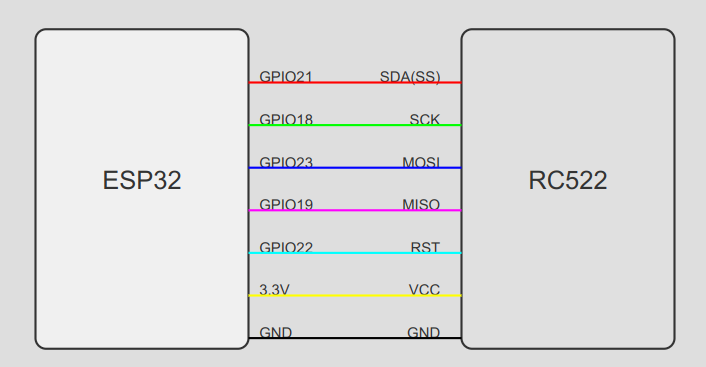

# RFID Student Attendance System

A comprehensive attendance tracking system using ESP32, RFID RC522, and Next.js with Firebase integration. The system allows for automated attendance tracking through RFID cards and provides a web interface for faculty members to view and manage attendance records.

## Features

- Real-time attendance tracking using RFID cards
- Web-based dashboard for attendance management
- Firebase integration for data storage
- ESP32-based RFID reader implementation
- Responsive web interface built with Next.js

## System Architecture

### Hardware Components
- ESP32 Microcontroller
- RFID RC522 Reader
- RFID Cards/Tags for Students

### Software Stack
- Next.js (Frontend & Backend)
- Firebase (Database)
- Arduino IDE (ESP32 Programming)

## Installation

### 1. Hardware Setup

Connect the RFID RC522 module to ESP32 using the following pin configuration:

```
RFID RC522 → ESP32
SDA (SS)  → GPIO21
SCK       → GPIO18
MOSI      → GPIO23
MISO      → GPIO19
RST       → GPIO22
GND       → GND
VCC       → 3.3V
```

See the connection diagram below for visual reference. 



### 2. Software Setup

#### Arduino Setup
1. Navigate to the `Arduino` folder
2. Open the `.ino` file in Arduino IDE
3. Install required libraries:
   - MFRC522 Library (for RFID RC522)
   - ESP32 Board Support Package
   - WiFi Library
4. Update WiFi credentials and server endpoint in the code
5. Upload the code to ESP32

#### Web Application Setup
1. Clone the repository
```bash
git clone https://github.com/wreckage0907/TapTrail.git
cd TapTrail
```

2. Install dependencies
```bash
npm install
# or
yarn install
```

3. Configure Firebase
Create a `.env.local` file in the root directory with your Firebase configuration:
```
NEXT_PUBLIC_FIREBASE_API_KEY=your_api_key
NEXT_PUBLIC_FIREBASE_AUTH_DOMAIN=your_auth_domain
NEXT_PUBLIC_FIREBASE_PROJECT_ID=your_project_id
NEXT_PUBLIC_FIREBASE_STORAGE_BUCKET=your_storage_bucket
NEXT_PUBLIC_FIREBASE_MESSAGING_SENDER_ID=your_messaging_sender_id
NEXT_PUBLIC_FIREBASE_APP_ID=your_app_id
```

4. Run the development server
```bash
npm run dev
# or
yarn dev
```

5. Open [http://localhost:3000](http://localhost:3000) in your browser

## Usage

1. Power up the ESP32 with the RFID reader
2. Start the Next.js web server
3. When a student scans their RFID card:
   - ESP32 reads the card data
   - Sends a POST request to the backend
   - Data is stored in Firebase
   - Web interface updates in real-time

## Contributing

1. Fork the repository
2. Create a feature branch (`git checkout -b feature/AmazingFeature`)
3. Commit your changes (`git commit -m 'Add some AmazingFeature'`)
4. Push to the branch (`git push origin feature/AmazingFeature`)
5. Open a Pull Request

